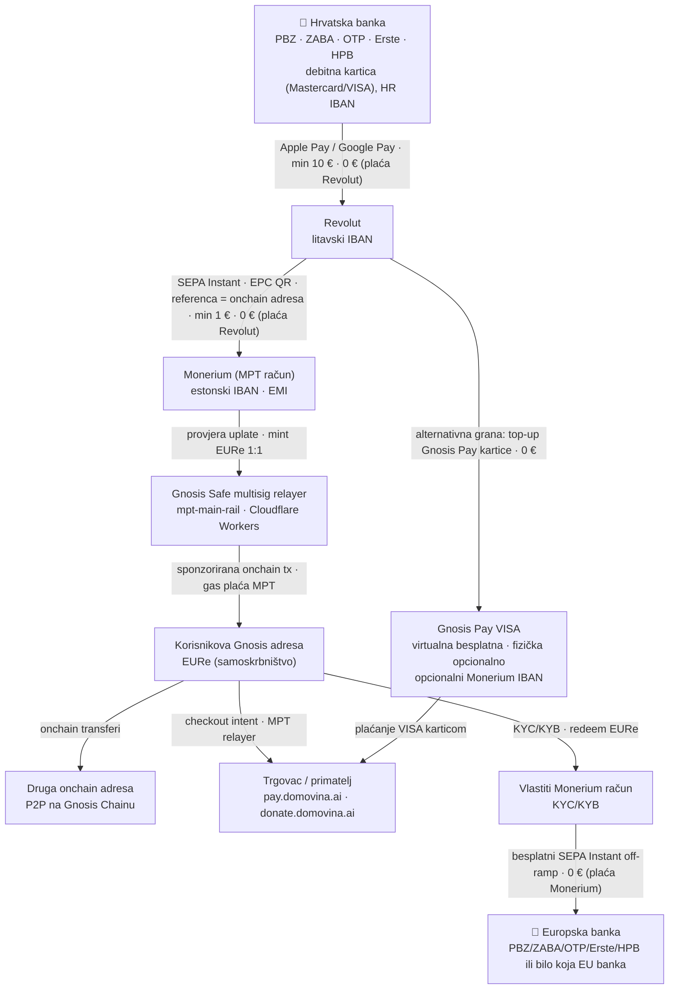
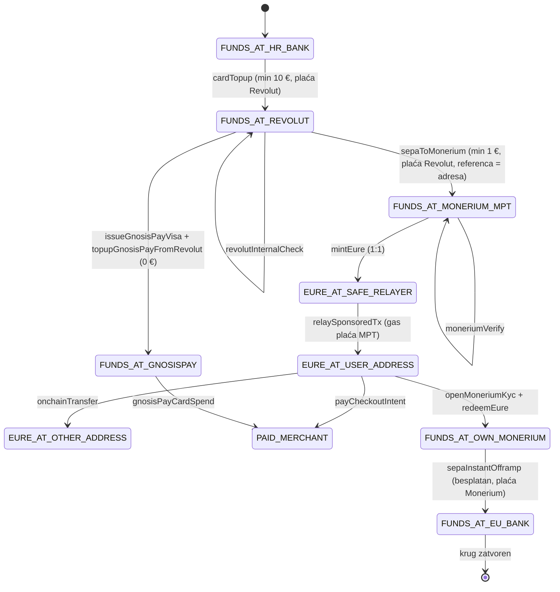

# MPT — dokumentirani tok novca / documented money flow

Izvor istine za graf i prijelaze je [`src/lib/mpt-machine.ts`](../src/lib/mpt-machine.ts) —
iz njega se generiraju React Flow vizualizacija, simulacije na landingu i vitest testovi.
Ovaj dokument je Mermaid preslika istog modela.

## Usmjereni graf toka novca

## State machine (prijelazi procesa)

## Guardovi (zaštitni limiti)

| Prijelaz | Limit | Tko plaća naknadu |
|---|---|---|
| `cardTopup` | min 10 € | Revolut (kartična transakcija, marketing) |
| `sepaToMonerium` | min 1 € | Revolut (SEPA Instant) |
| `mintEure` / `redeemEure` | — | Monerium (besplatno, 1:1) |
| `relaySponsoredTx` | — | MPT (sponzorirani gas) |
| `sepaInstantOfframp` | — | Monerium (besplatan SEPA Instant) |
| `issueGnosisPayVisa` | virtualna besplatna | Gnosis Pay |
| `topupGnosisPayFromRevolut` | — | 0 € za korisnika |

**Invarijante** (dokazane u `src/lib/mpt-machine.test.ts`, `npm test`):

1. Korisnik na svakom koraku svakog scenarija plaća **0 €**.
2. Iznosi se čuvaju **1:1** — zbroj svih salda konstantan je kroz cijeli tok (nema curenja).
3. Nijedno saldo nikad ne ide u minus; guardovi odbijaju iznose ispod limita bez pomicanja novca.

## Simulacijski scenariji (N = 6)

1. **On-ramp** — banka → EURe na Gnosis adresi (10 €)
2. **Puni krug** — banka → … → besplatni off-ramp natrag u banku (50 € ode, 50 € se vrati)
3. **Onchain P2P** — višestruki transferi nakon on-rampa
4. **MPT checkout intent** — plaćanje trgovcu (produkcija: pay.domovina.ai, donate.domovina.ai)
5. **Gnosis Pay VISA grana** — besplatna virtualna kartica, top-up iz Revoluta, plaćanje karticom
6. **Guardovi** — odbijanje 9,99 € kartičnog top-upa i 0,50 € SEPA-e, zatim ispravni iznosi prolaze
