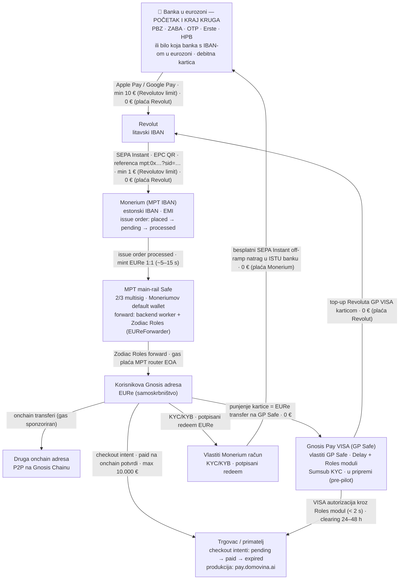
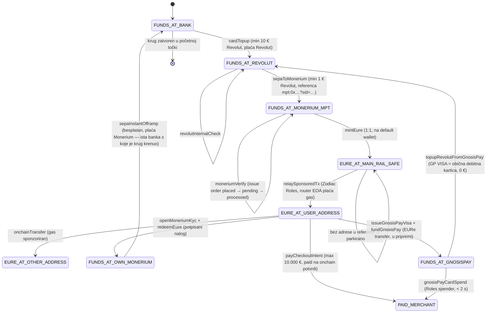

# MPT — dokumentirani tok novca / documented money flow

Izvor istine za graf i prijelaze je [`src/lib/mpt-machine.ts`](../src/lib/mpt-machine.ts) —
iz njega se generiraju React Flow vizualizacija, simulacije na landingu i vitest testovi.
Model je verificiran protiv referentne implementacije i njezine dokumentacije:

- `pay.domovina.ai/docs/monerium-private.md` — Monerium Private API single source of truth
- `pay.domovina.ai/docs/plans/gnosis-pay-cards/` — Gnosis Pay plan integracije (pre-pilot)
- `pay.domovina.ai/backend/` — worker `pay-domovina-backend`: Monerium webhook receiver,
  parser reference (`monerium/sid.ts`), Zodiac forward (`router/safe.ts`), checkout intenti (`intents/`)

Ovaj dokument je Mermaid preslika istog modela.

## Usmjereni graf toka novca

## State machine (prijelazi procesa)

## Guardovi (zaštitni limiti)

| Prijelaz | Limit | Porijeklo | Tko plaća naknadu |
|---|---|---|---|
| `cardTopup` | min 10 € | Revolutovo produktno pravilo | Revolut (kartična transakcija, marketing) |
| `sepaToMonerium` | min 1 € | Revolutovo produktno pravilo | Revolut (SEPA Instant) |
| `payCheckoutIntent` | > 0 € i ≤ 10.000 €, TTL default 15 min | MPT kod (`intents/api.ts`) | — |
| `mintEure` / `redeemEure` | redeem ≥ 15.000 € traži dokument | Monerium | Monerium (besplatno, 1:1) |
| `relaySponsoredTx` | rola smije samo `EURe.transfer`; bez adrese → parkirano na Safeu | MPT kod (Zodiac rola) | MPT (router EOA plaća gas) |
| `onchainTransfer` | 5 besplatnih dnevno po potpisniku | MPT wallet relayer | MPT (sponzorirani gas) |
| `sepaInstantOfframp` | — | — | Monerium (besplatan SEPA Instant) |
| `issueGnosisPayVisa` | virtualna besplatna, max 5; Sumsub KYC obavezan | Gnosis Pay | Gnosis Pay |
| `topupRevolutFromGnosisPay` | min 10 € (kartični top-up) | Revolutovo produktno pravilo | Revolut |
| `gnosisPayCardSpend` | dnevni limit default 350 EURe (1–8000) | Gnosis Pay Roles modul | Gnosis Pay |

**Invarijante** (dokazane u `src/lib/mpt-machine.test.ts`, `npm test`):

1. Korisnik na svakom koraku svakog scenarija plaća **0 €**.
2. Iznosi se čuvaju **1:1** — zbroj svih salda konstantan je kroz cijeli tok (nema curenja).
3. Nijedno saldo nikad ne ide u minus; guardovi (min/max) odbijaju iznose izvan limita bez pomicanja novca.

## Simulacijski scenariji (N = 6)

1. **On-ramp** — banka → EURe na Gnosis adresi (10 €)
2. **Puni krug** — banka → … → potpisani redeem → besplatni off-ramp natrag u banku (50 € ode, 50 € se vrati)
3. **Onchain P2P** — višestruki transferi nakon on-rampa (sponzorirani gas)
4. **MPT checkout intent** — plaćanje trgovcu, `paid` na onchain potvrdi (produkcija: pay.domovina.ai)
5. **Gnosis Pay VISA grana** — virtualna kartica na vlastitom GP Safeu, punjenje EURe transferom, POS plaćanje i besplatni top-up Revoluta karticom — krug se vrti dalje (u pripremi)
6. **Guardovi** — odbijanje 9,99 € top-upa i 0,50 € SEPA-e (Revolutovi limiti); u testovima i odbijanje intenta > 10.000 € (MPT guard)
